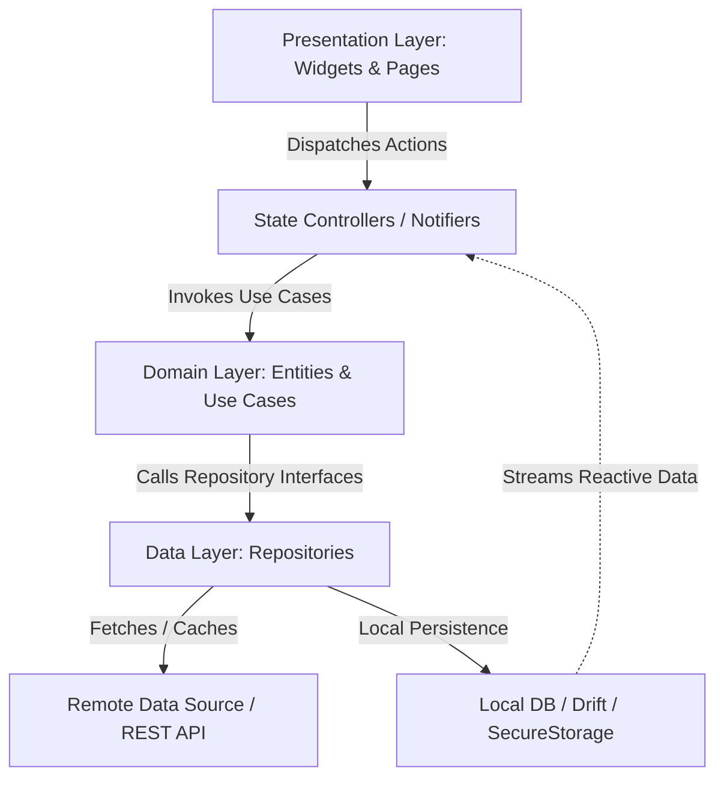

# System Architecture: PulseFit

## 1. Architectural Paradigm
- **Pattern**: Clean Architecture with Riverpod
- **Data Flow**: Unidirectional Data Flow (UDF) / Reactive Streams



## 2. Directory & Package Blueprint
```
lib/
├── main.dart
├── app/
│   ├── app.dart
│   ├── router/           # go_router declarative routing
│   └── theme/            # Material 3 light/dark tokens
├── core/
│   ├── network/          # Dio client, interceptors & error handlers
│   ├── database/         # Drift SQLite DB & DAOs
│   ├── security/         # FlutterSecureStorage & BiometricAuth
│   └── widgets/          # Shared atomic components & charts
└── features/
    └── [feature_name]/
        ├── data/         # DTOs, data sources, repository implementations
        ├── domain/       # Domain entities & business contracts
        └── presentation/ # Riverpod/Bloc controllers & UI screens
```

## 3. State Management & Data Flow Standard
1. State is strictly immutable (`@freezed` / Dart 3 sealed classes).
2. UI components are stateless consumers (`ConsumerWidget`).
3. Network calls always execute asynchronously through dedicated repositories.
